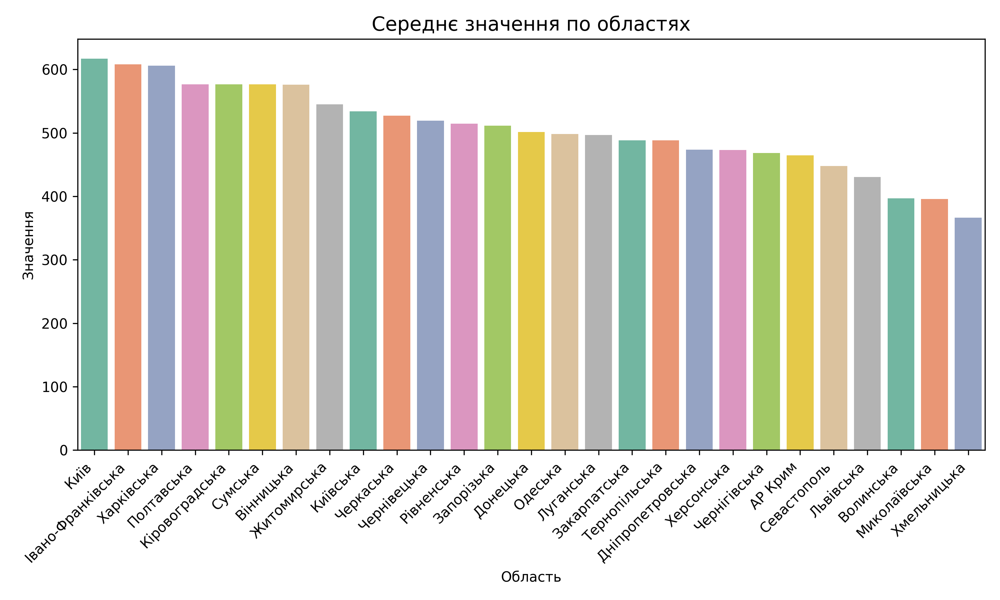

# CSV Processing API/Tool
A lightweight and universal **CSV data visualization service** built with **FastAPI** and **Python**.  
It allows users to upload CSV files and automatically generate **statistical bar charts** based on selected columns.  
The solution combines the flexibility of **pandas** and **seaborn** with the performance of **FastAPI**,  
delivering charts on demand — directly through an API endpoint or as saved image files.


## How to start
```bash
docker-compose --profile dev up --build
```


## Details
1) The main visualization logic is implemented in: `api/modules/processing/utils/csv_process.py`.
2) To explore the interactive API docs: `http://127.0.0.1:8000/docs`

## Result

